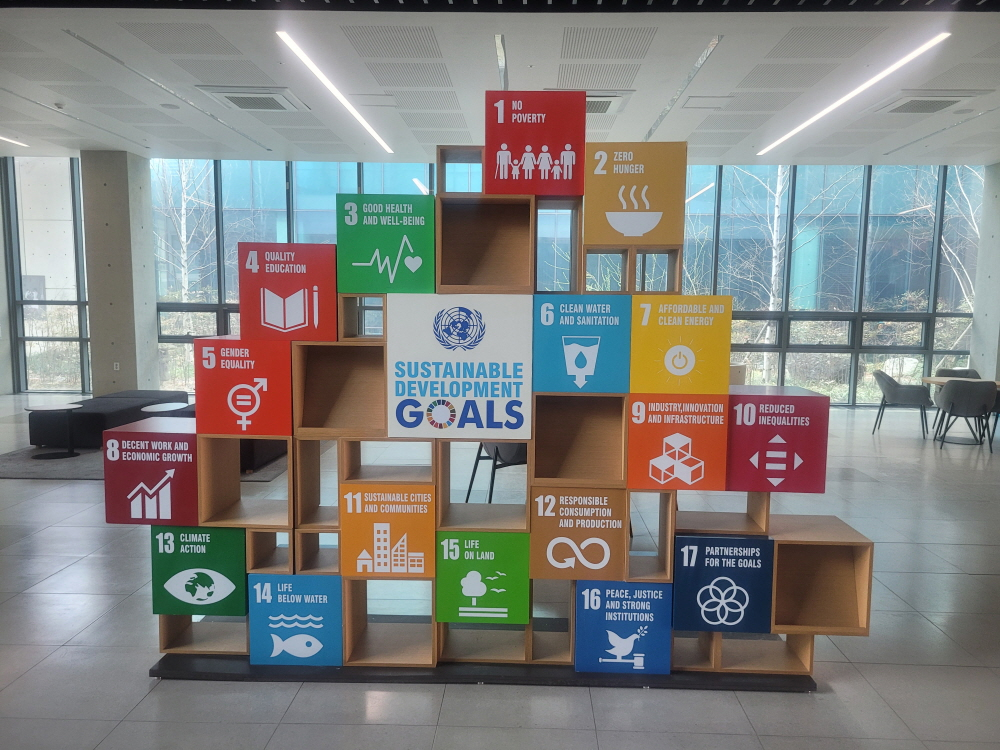
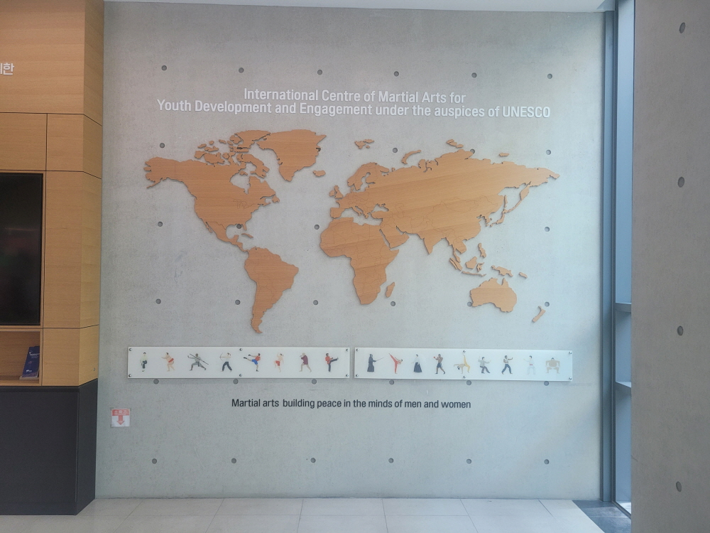
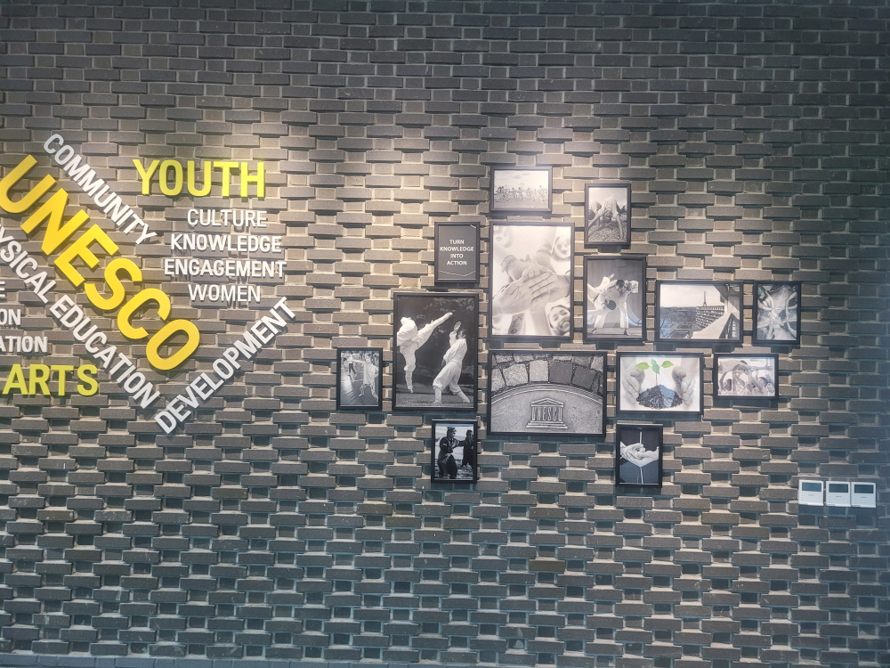
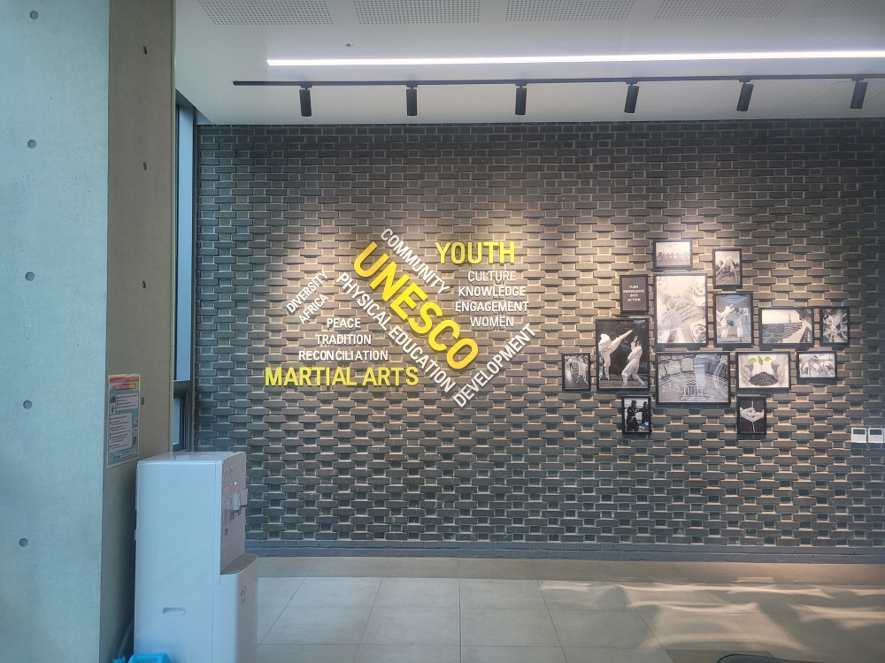
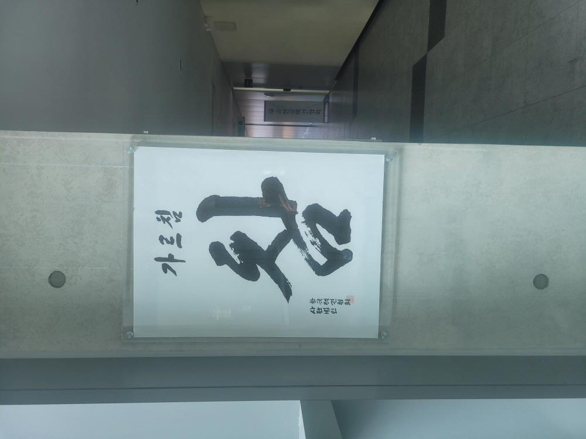

전 세계 무예의 보존과 전파를 위해 설립된 **유네스코 국제무예센터**를 방문했습니다. 현대적이고 웅장한 내부 시설들을 통해 무예가 단순한 운동을 넘어 인류의 소중한 문화유산임을 다시 한번 느낄 수 있는 시간이었습니다.

센터에 들어서자마자 마주하는 웅장한 로비입니다. 유네스코의 정신이 깃든 현대적인 건축 디자인이 인상적입니다.

전시관 내부에는 다양한 무예의 역사와 철학을 한눈에 볼 수 있는 자료들이 체계적으로 정리되어 있습니다.

실제 무예 교육과 수련이 이루어지는 공간입니다. 넓고 쾌적한 시설 덕분에 수련에 온전히 집중할 수 있는 분위기가 조성되어 있습니다.

각 무예 종목의 특징과 문화적 배경을 상세히 설명해 주는 전시 패널들이 곳곳에 배치되어 있어 교육적인 효과도 뛰어납니다.

방문객들이 무예와 관련된 담소를 나누거나 잠시 쉬어갈 수 있는 편안한 휴게 공간도 마련되어 있습니다.

무예의 전통을 증명하는 소중한 역사적 사료와 전시물들이 정교하게 관리되고 있는 모습입니다.

각 시설을 이어주는 복도 공간조차 무예의 역동성을 상징하는 디자인 요소들로 가득 차 있어 이동 중에도 볼거리가 끊이지 않습니다.

**유네스코 국제무예센터는 무예를 통해 세계 평화와 화합을 실천하는 허브로서 그 역할을 다하고 있었습니다.** 무예에 관심 있는 분들이라면 꼭 한 번 방문해 보시길 추천드립니다.
